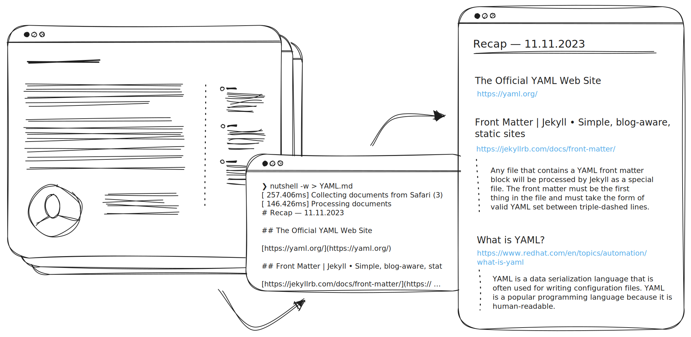

# Kurzreferat **Markdown**  im Kurs `P02b-WS23` bei *Prof. Dr. V. Köppen*, and der FH-Potsdam, von *Nicolai Bach*

---

## Themen und Ablauf

### Präsentation (10 Min.)

- Definitionen
- ? Hintergrund und Entstehung
- Einsatzgebiete und Erweiterungen
- Die Syntax
- Funktionsweise
- Markdown und Ich

### Übung (~ 5 Min.)

Ein Dokument mit Markdown formatieren.

---

<!--
Paraphrasiertes Zitat:
Markdown ist ein Text-zu-HTML Konvertierungs-Werkzeug für Menschen, die für das Web schreiben.
Markdown ermöglicht dir Schreiben in einem einfach zu lesenden und einfach zu schreibenden plain-text Format und es anschließend in strukturell valides XHTML oder HTML umzuwandeln.
-->

## Definitionen: Das Original

> Markdown is a text-to-HTML conversion tool for web writers. Markdown allows you to write using an easy-to-read, easy-to-write plain text format, then convert it to structurally valid XHTML (or HTML).

John Gruber (2004), Markdown
https://daringfireball.net/projects/markdown/

---

<!--
- Technische Begriffe kurz erläutern
- plain text in Abgrenzung zu rich text (binary)
- HTML: Hypertext Markup Language
- HTML VS XHTML und *valid*: hier erkennt man ganz deutlich, dass es 2004 ist
- In der Definition stecken schon 2 Dinge
  - Markdown das Format
  - und Markdown das Tool (Perl script)
- Hervorheben, dass Gruber eine spezielle Zielgruppe und einen (!) speziellen Anwendungsfall im Sinn hatte: Schreiben in BBEdit, Blogging mit Movable Type. (https://daringfireball.net/2004/03/dive_into_markdown)
-->

### Schlüsselbegriffe aus John Grubers Definition

#### Technik

- plain text format
- (valid) HTML
- conversion tool

#### Intention

- for web writers
- easy to read
- easy to write

---

xkcd (2011), Standards
CC BY-NC 2.5
https://xkcd.com/927/

---

---

## Addendum

v.1.0.0 | 2023-11-12 | CC BY-NC-SA 4.0

- https://github.com/nicolaibach/p02b-ws23-referat-md
- Link zum aktuellen release
