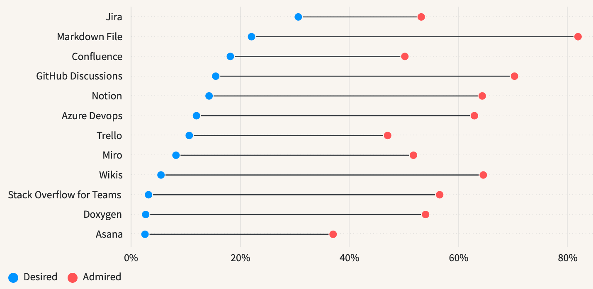

# Kurzreferat **<span class="dim">\#</span> Markdown** im Kurs `P02b-WS23` bei Prof. Dr. V. Köppen,<br>an der FH-Potsdam

von Nicolai Bach

---

## Themen und Ablauf

<div class="columns">
<div>

### Präsentation (10 Min.)

- Ursprung
- Adaption
- Syntax
- Anwendungen

</div>
<div>

### Übung (~ 5 Min.)

Ein Dokument mit Markdown formatieren.

</div>
</div>

---

<!--
John Gruber: Informatiker, Blogger, Web Designer …
Grubers Setup: Warum hat er MD *erfunden* und welche Probleme wollte er damit lösen. (Schreiben in BBEdit, Blogging mit Movable Type …)
Er findet HTML einfach. Trotzdem: Das ist ihm alles zu umständlich.
-->

<div class="columns">
<div>

## Ursprung: Ein unzufriedener Blogger

> Eventually, it dawned on me: *this is madness*. The primary advantage to using a computer for writing is the immediacy of editing. Write, read, revise, all in the same window, all in the same mode.

John Gruber (2004), Dive Into Markdown
https://daringfireball.net/2004/03/dive_into_markdown

</div>
<div>


xkcd, Tech Loops, CC BY-NC 2.5, https://xkcd.com/927/

</div>
</div>

---

<!--
Paraphrasiertes Zitat:
Markdown ist ein Text-zu-HTML Konvertierungs-Werkzeug für Menschen, die für das Web schreiben.
Markdown ermöglicht das Schreiben in einem einfach zu lesenden und einfach zu schreibenden Klartext-Format
und die anschließende Umwandlung in strukturell valides XHTML oder HTML.

- ”plain text” in Abgrenzung zu *rich text* (binary)
	… ausarbeiten

- Hypertext Markup Language (HTML)

- HTML VS XHTML und *valid*: hier erkennt man ganz deutlich, dass es 2004 ist.
  Die beiden Standards existierren eine Zeit lang parallel zu eianander und Browser
	unterscheiden verschiedene Parsing-Modi: Srtrict (XML) und Transitional (HTML).
	Im IE gab es sogar etwas, dass sich ”Quirks Mode” nannte. Viellecht geistert das noch
	immer in den Engines rum.

- In der Definition stecken schon 2 (eigentlich 3) Dinge
  - Markdown das Format
  - und Markdown das Tool (Perl script)
  - und Markdown die Philosophie.

- Gruber hatte eine spezielle Zielgruppe und einen (!) speziellen Anwendungsfall im Sinn.
-->

## Ursprung: Markdown.pl

<div class="columns">
<div>

- John Gruber & Aaron Schwartz
- Erste Version 2003, Letzte Version (1.0.1) 2004

> Markdown is a text-to-HTML conversion tool for web writers. Markdown allows you to write using an easy-to-read, easy-to-write plain text format, then convert it to structurally valid XHTML (or HTML).

John Gruber (2004), Markdown
https://daringfireball.net/projects/markdown/

</div>
<div>

### Technik

- plain text format
- (valid) (X)HTML
- conversion tool

### Intention

- for web writers
- easy to read
- easy to write

</div>
</div>

---

<!--
Aktuelle Definitionen unterscheiden sich, zumindest in Teilen, von der ersten Def. von Gruber. z.B. ist hier nicht mehr explizit die Rede von HTML.

Die Defs. unterschdeiden sich auch von einanden. Mal ist die Rede von einem *Format*, mal von einer *Syntax*. Die beiden Defs. der IETF stammen aus der Spzifikation des Markdown `media type`. Das ist MD also auch.

In einer Definition wird MD, auf Grund der wilden verbreitung und sehr freien Adaption, sogar als *Internet Meme* bezeichnet.
-->

## Adaption: Aktuelle Definition(en)

<div class="columns">
<div>

> Markdown, the subject of this document, is an /informal/ plain-text formatting syntax that is intentionally targeted at non-technical users […] using unspecialized tools.

> Markdown has become something of an Internet meme, in that Markdown gets received, reinterpreted, and reworked as additional communities encounter it.

Internet Engineering Task Force (IETF) (2016), RFC7764:  Guidance on Markdown: Design Philosophies, Stability Strategies, and Select Registrations
https://www.rfc-editor.org/rfc/rfc7764

</div>
<div>

> Markdown is a plain text format for writing structured documents, based on conventions for indicating formatting in email and usenet posts

John MacFarlane (2021), CommonMark Spec Version 0.30
https://spec.commonmark.org/0.30/

</div>
</div>

---

<!--
Diese Bezeichnung *Meme* trifft es ganz gut denn in der ursprünglichen Version ist MD nicht klar spezifiziert. Es passiert, was passieren musste. Es entstanden unzählige Ableger des 1. Scripts, in dem Versuch “es jetzt mal richtig zu machen”. Einige Implementationen versuchen nur MD *korrekt* zu parsen, andere führen auch neue Features ein.
-->

## Adaption: What the Spec?!

<div class="columns">
<div>


xkcd, Standards, CC BY-NC 2.5
https://xkcd.com/927/

</div>
<div>

- Es gibt diverse Implementationen und Variationen
- Kompatibilität ist nicht gewährleistet

</div>
</div>

---

<!--
Was wir hier sehe ist nur die Spitze des Eisbergs!
-->


---

<!--
Trotzdem — oder gerade deswegen — erfreut sich MD großer Beliebtheit. Die Anzahl der Fragen, die auf SO zu MD gestellt werden steigt bis heute an. Hier zu sehen im Vergleich zu Letx und r-markdown, die ähnlich häufig thematisiert werden.
-->

## Adaption: SO Anfragen Trend


Stack Overflow Trends für `markdown`, `r-markdown` und `latex` im Zeitraum 2008 - 2023-11-13T15:25:20.925Z
https://insights.stackoverflow.com/trends/?tags=markdown,r-markdown,latex

---

## Adaption: SO Developer Survey 2023

<div class="columns">
<div>

### Die Umfrage

- 2023-05-08 - 2023-05-19
- 89,184 Software Entwickler
- aus 185 Ländern

Stack Overflow 2023 Developer Survey: Methodology
https://survey.stackoverflow.co/2023/#methodology

</div>
<div>

### Kategorie “Asynchronous tools”

> Markdown files are the second most desired asynchronous tool and the most admired asynchronous tool.

Stack Overflow 2023 Developer Survey: Admired and desired asynchronous tools
https://survey.stackoverflow.co/2023/#section-admired-and-desired-asynchronous-tools


</div>
</div>

---

## Adaption: SO Developer Survey 2023 | Grafik



Stack Overflow 2023 Developer Survey: Admired and desired asynchronous tools
https://survey.stackoverflow.co/2023/#section-admired-and-desired-asynchronous-tools

---

<!--
Heute ist Markdown fast überall zu finden.
Vor allem im Web. Sehe ich eine Textbox, sei sie noch so klein, dann erwarte ich inzwischen zumindest ein Sub-Set von Markdown benutzen zu können.
-->

## Adaption: Das Ökosystem Heute

### Erweiterungen der Syntax

- Diagramme mit Mermaid
- Formeln MathJax

### Ergänzende Tools

- Layot Engines wie Liquid o. Nunjucks
- Metadaten mit YAML (Front Matter)

### Apps & Plattformen

- Web: 11ty, Jekyll, GitHub (Pages), NextCloud
- Desktop Apps: iA Writer, Marked 2


---

## Syntax: Basics (CommonMark Flavour)

| Eingabe                                      | Ausgabe                                       |
| :------------------------------------------- | :-------------------------------------------- |
| `*Italic*`                                   | *Italic*                                      |
| `**Bold**`                                   | **Bold**                                      |
| `[Link](http://a.com)`                       | [Link](http://a.com)                          |
| `[Referenz Link][1] … ⋮ … [1]: http://b.org` | [Referenz Link](http://a.com)                 |
| ``                 |  |

CommonMark, Hilfe (2023-11-14T05:07:41.612Z)
https://commonmark.org/help/

---

## Syntax: Basics (CommonMark Flavour)

<div class="columns">
<div>

### Eingabe

```md
### Ausgabe

> Blockquote

- List
- List
	- List

1. One
2. Two
3. Three

---
```

</div>
<div>

### Asugabe

> Blockquote

- List
- List
	- List

1. One
2. Two
3. Three

<hr />

</div>
</div>

CommonMark, Hilfe (2023-11-14T05:07:41.612Z)
https://commonmark.org/help/

---

## Anwenungen: nutshell


---

## Anwenungen: @ncl/cli::help()


> The first 90 percent of the code accounts for the first 90 percent of the development time. The remaining 10 percent of the code accounts for the other 90 percent of the development time.

 Tom Cargill, Bell Labs

---


---

## Anwenungen: Marp

- diese Präsentation wurde in Markdown geschrieben
- [Marp](https://marp.app) hat mir dabei geholfen
- Das Projekt ist online unter https://github.com/nicolaibach/p02b-ws23-referat-md

> Marp for VS Code: Create slide deck written in Marp Markdown on VS Code

Marp, Marp for VS Code
https://github.com/marp-team/marp-vscode

---


---

<!--
Nicht vergessen: Danke für die eure Aufmerksamkeit
-->

## Addendum

<div class="columns">
<div>

### Quellcode

https://github.com/nicolaibach/p02b-ws23-referat-md

### Slide Decks

https://github.com/nicolaibach/p02b-ws23-referat-md/releases

### Literatur und Quellen

https://github.com/nicolaibach/p02b-ws23-referat-md/wiki/Research-Material

</div>
<div>

| Datum      | Version |
| :--------- | :------ |
| 2023-11-14 | v1.0.1  |

### Lizenz

<p xmlns:cc="http://creativecommons.org/ns#" xmlns:dct="http://purl.org/dc/terms/"><a property="dct:title"
		rel="cc:attributionURL" href="https://github.com/nicolaibach/p02b-ws23-referat-md">p02b-ws23-referat-md</a> by <a
		rel="cc:attributionURL dct:creator" property="cc:attributionName" href="https://github.com/nicolaibach/">Nicolai
		Bach</a> is licensed under <a href="http://creativecommons.org/licenses/by-nc-sa/4.0/?ref=chooser-v1"
		target="_blank" rel="license noopener noreferrer" style="display:inline-block;">Attribution-NonCommercial-ShareAlike 4.0 International (CC BY-NC-SA 4.0)</a></p>

</div>
</div>

---

## Übung

Öffne den *CommonMark Spielplatz* in einem Webbrowser. Dort kannst du Markdown eingeben und parallel das Resultat der Umwandlung als AST, HTML oder gerenderte Vorschau betrachten.

<div class="columns">
<div>

### CommonMark Dingus


https://spec.commonmark.org/dingus/

</div>
<div>

### CommonMark Hilfe


https://commonmark.org/help/

</div>
</div>
